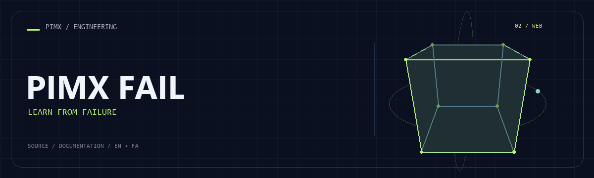

<div align="center">



**[English](README.md) · [فارسی](README.fa.md)**

</div>

# 📉 PIMX FAIL

<!-- pimx-live-site:start -->
## Live website

**[Open PIMX_FAIL ↗](https://pimxfail.pages.dev/)**
<!-- pimx-live-site:end -->

A searchable archive of failed startups with company stories, failure lessons, technical blueprints and an optional Gemini analysis endpoint.

[GitHub](https://github.com/MOHAMMADREZAABEDINPOOR/PIMX_FAIL) · [PIMX / Profile](https://github.com/MOHAMMADREZAABEDINPOOR) · [Static artwork](assets/readme/hero.png)

| At a glance | Details |
|:---|:---|
| 📉 Experience | Web application / browser experience |
| 🧰 Built with | `React` · `Vite` · `TypeScript` · `Express` |
| 🌐 Documentation | [English](README.md) · [فارسی](README.fa.md) |

[✨ Features](#features) · [🚀 Getting started](#getting-started) · [⚙️ Configuration](#configuration) · [🌍 Deployment](#deployment)

---

<a id="features"></a>

## ✨ Features

| Area | Included capability |
|:---|:---|
| ⚡ Workflow | Filter startups and open individual case studies |
| ⭐ Collection | Bookmark cases and retain theme preferences locally |
| ⚡ Workflow | Explore technical blueprints and structured startup data |
| 🧠 Intelligence | Optional analysis API and visitor analytics |

<a id="stack"></a>

## 🧰 Stack

| Tool | Version / source |
|---|---|
| React | `^19.0.1` |
| Vite | `^6.2.3` |
| TypeScript | `~5.8.2` |
| Express | `^4.21.2` |
| Motion | `^12.23.24` |
| Tailwind CSS | `^4.1.14` |

<a id="getting-started"></a>

## 🚀 Getting started

Node.js 22.12+ and the package manager declared in package.json. Install dependencies from the checked-in lockfile where available.

```bash
git clone https://github.com/MOHAMMADREZAABEDINPOOR/PIMX_FAIL.git
cd PIMX_FAIL

npm ci
npm run dev
```

<a id="configuration"></a>

## ⚙️ Configuration

These names are found in the example configuration or source; not all are required. Check their defaults/usage in those files and supply secrets only in your local or hosting environment.

| Name | Role |
|---|---|
| `APP_URL` | Application setting; inspect its definition |
| `GEMINI_API_KEY` | Credential/connection setting; keep private |
| `PORT` | Application setting; inspect its definition |

Hosting bindings: `VISIT_KV`.

<a id="usage"></a>

## 🎯 Usage

Browse the catalog, filter by available categories and open a startup detail page. Add `GEMINI_API_KEY` on the server to enable provider-backed analysis.

<a id="project-structure"></a>

## 🗂️ Project structure

| Path | Role |
|---|---|
| [`assets/`](assets/) | Brand/media/README assets |
| [`scripts/`](scripts/) | Development and maintenance utilities |
| [`src/`](src/) | Application source |
| [`index.html`](index.html) | Project entry/configuration file |
| [`metadata.json`](metadata.json) | Project entry/configuration file |
| [`package.json`](package.json) | Project entry/configuration file |
| [`tsconfig.json`](tsconfig.json) | Project entry/configuration file |
| [`wrangler.toml`](wrangler.toml) | Project entry/configuration file |

<a id="commands-and-checks"></a>

## 🧪 Commands and checks

| Command | Purpose |
|:---|:---|
| `npm run dev` | 🧑‍💻 Development server |
| `npm run build` | 📦 Production build |
| `npm run start` | ▶️ Application server |
| `npm run preview` | 👀 Preview a build |
| `npm run lint` | 🧹 Lint source |

```bash
npm run dev
npm run build
npm run start
npm run preview
npm run lint
```

These commands are declared in package.json; the list is not a test execution report. Test commands may need a browser, service or prepared database.

<a id="deployment"></a>

## 🌍 Deployment

Deploy the build according to its architecture: server-backed projects need a Node process; static Vite frontends can host dist. Pages functions, KV or D1 require separate configuration.

<a id="limitations"></a>

## 📌 Limitations

Catalog entries are research material, not audited business records. Fallback analysis is generated by local rules. Some catalog-maintenance scripts referenced by package.json are absent from this snapshot.

<a id="troubleshooting"></a>

## 🛠️ Troubleshooting

- Missing packages: install dependencies using the project’s package manager.
- API/network failure: check the configured origin, provider and hosting bindings.
- Old assets: rebuild when a build script exists, then clear the browser cache.

<a id="contributing"></a>

## 🤝 Contributing

Create a focused branch, verify the affected behavior and explain the change clearly. Keep private data, build outputs and local databases out of commits.

<a id="license"></a>

## 📄 License

No repository-level license file is included in this snapshot. Public visibility alone does not grant reuse rights; contact the repository owner for terms.

---

Part of **PIMX** · Documentation in English and Persian.

---

<div align="center">

📉 **PIMX FAIL** · [English](README.md) · [فارسی](README.fa.md)

</div>
